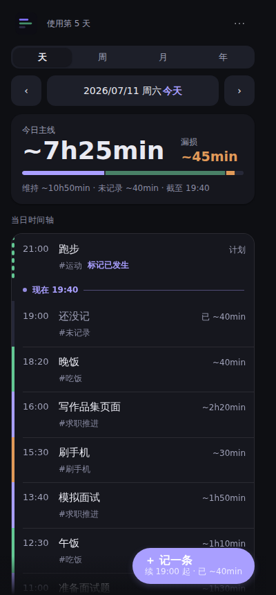
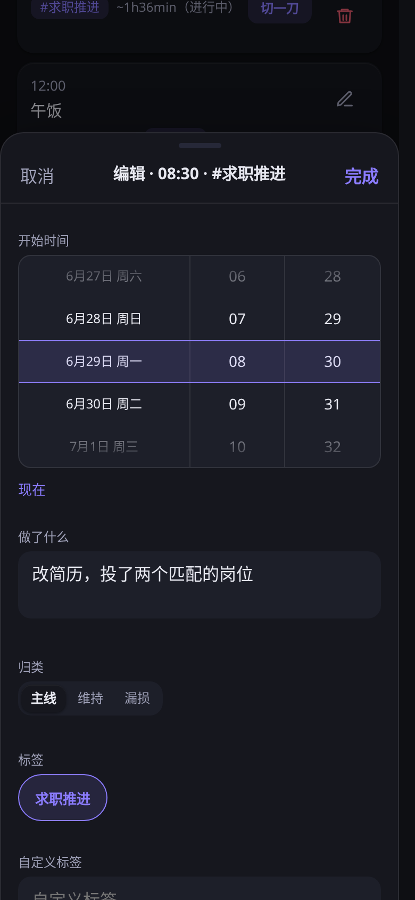

# 时间尺

> Status: active  
> Updated: 2026-06-29
> Intended user: 求职主线时间记录和每日复盘的个人使用者。  
> Operating boundary: 本地静态 PWA，只记录时间去向，不做云同步、账号管理、KPI 考核或投资/合规判断。  
> Risks and failure modes: 忘记记录导致“未记录”偏高、长时间间隔被整体计为未记录、周/月/年视图诱发过度复盘、浏览器本地数据被清理。  

求职主线时间记录仪 — 每天看清时间进了哪里。





## 本地运行

应用使用原生 ES modules，本地请通过 HTTP server 打开，不要直接双击 `index.html`。

```bash
cd time-logger
python3 -m http.server 8080
# 浏览器打开 http://localhost:8080
```

真机移动端验证不需要推送或部署。手机和电脑同 Wi-Fi 时，可在本机启动：

```bash
python3 -m http.server 8080 --bind 0.0.0.0
# 手机尝试打开 http://192.168.101.101:8080/
```

若手机打不开，先检查服务是否绑定 `0.0.0.0`、Windows 防火墙、手机和电脑是否同网，以及 WSL2 端口隔离。

## 装到手机主屏（PWA）

iOS Safari：打开页面 → 分享 → 添加到主屏幕。  
Android Chrome：打开页面 → 菜单 → 添加到主屏幕。

应用已包含 SVG 源图标、192/512 PNG、maskable PNG 和 Apple touch icon。Android Chrome 的安装入口仍由浏览器根据 manifest、Service Worker、HTTPS/Pages 访问环境综合判断。

## GitHub Pages 发布（隐私边界）

只把 `time-logger/` 作为独立仓库发布，例如 `github.com/<your-name>/time-logger`。不要把父目录、`toolkit/`、`archive/`、导出的 `timelog-*.json`、真实记录 JSON、真实截图或具体个人线索提交到 GitHub。README 展示图只允许使用 `docs/assets/` 中的固定演示数据 PNG。

推荐发布方式：

1. 在 `time-logger/` 内初始化独立仓库。
2. 推送到 `github.com/wowayou/time-logger`。
3. GitHub Pages 选择从仓库根目录发布。
4. 其他设备通过 Pages URL 打开，再添加到主屏幕。

代码和界面文案可以公开；数据不能公开。每台设备的数据仍只保存在本机 `localStorage['timelog.v1']`，访问 Pages 不会上传、同步或合并记录。

## 多设备使用

- 同一个 Pages URL 只是同一个应用入口，不是云同步。
- 新设备首次打开时本地数据为空。
- 迁移数据靠原设备「下载」JSON，再到新设备「导入」。
- 「下载」使用浏览器原生下载能力，保存位置由浏览器或系统设置决定，网页不能强制指定路径或弹出原生位置选择器。
- 不提交导出的备份 JSON，不提交真实记录截图。

## 文件地图

| 文件 | 作用 |
|---|---|
| `index.html` | DOM 壳、PWA/meta 引用、`styles.css` 和 `src/app.js` 模块入口 |
| `styles.css` | 全部样式，包含主题、布局、控件、sheet、footer 和响应式规则 |
| `src/time.js` | 本地日期解析、格式化、周期范围 |
| `src/storage.js` | `localStorage['timelog.v1']` 读取/保存和导入合并 |
| `src/stats.js` | 纯统计逻辑、按日分段、长段确认绑定 |
| `src/pickers.js` | 移动滚轮与桌面日期时间选择器 |
| `src/ui.js` | 渲染模板、图标、tooltip helper 和 DOM 更新 |
| `package.json` / `package-lock.json` | 开发期 Playwright UI smoke 依赖锁定，不参与运行时 |
| `playwright.config.js` / `tests/` | 响应式 UI smoke，启动本地静态 server 验证 |
| `sw.js` | Service Worker，离线缓存 |
| `manifest.webmanifest` | PWA 清单（名称、图标、版本） |
| `icon.svg` | 应用源图标 |
| `icons/` | PWA、maskable 和 Apple touch PNG 图标 |
| `docs/assets/` | README 固定演示数据截图，不放真实记录 |
| `ROADMAP.md` | 已知问题修复状态和后续非本轮事项 |
| `scripts/project_audit.py` | 开发期红线审计脚本，零运行时依赖 |
| `scripts/confirm_logic_smoke.py` | 确认逻辑、百分比格式和日边界 smoke，调用本机 `node` 执行真实 ES modules |

## 维护审计

```bash
python3 scripts/project_audit.py
python3 scripts/confirm_logic_smoke.py
npm run test:ui
git diff --check
```

审计脚本检查 PWA 版本、图标资源、Service Worker 缓存列表、tooltip/icon 红线、README 演示截图白名单和文档隐私红线。确认逻辑 smoke 直接导入 `src/stats.js`，跑固定用例、日边界回归和随机压测。UI smoke 使用开发期 Playwright 覆盖 320/375/430/768 宽度、空数据/单条记录/昨日残留记录和分享按钮显示/隐藏。

开发期 npm 只允许用于测试：`package.json` 保持 `"private": true`、`"type": "module"`，禁止新增运行时 `dependencies`，禁止提交 `node_modules/`、`test-results/`、`playwright-report/`。应用运行时仍是原生 ES modules + 静态文件，不引入构建流程。

## 数据模型

数据存在 `localStorage['timelog.v1']`，结构：

```json
{
  "version": 1,
  "entries": [
    {
      "id": "abc123",
      "ts": "2026-06-28T09:00",
      "what": "写简历",
      "tags": ["求职推进"],
      "longConfirm": { "startTs": "2026-06-28T09:00", "endTs": "2026-06-28T13:10" }
    }
  ]
}
```

时长 = 当前条到下一条 ts 的间隔，渲染时实时算，不存储。统计以本地自然日 00:00 为硬边界：空日不继承前一天最后标签；某天第一条记录之前从 00:00 起计为未记录；周/月/年汇总按每日独立统计累加。统计以分钟数为权威值：`job` / `other` / `unrecorded` / `pending` / `total` 都先按分钟累加，条形图按分钟比例显示，百分比只用于展示，不反向参与统计，也不强行凑满 100%。

标签为"未知"的段落计为**未记录**。有明确标签但超过 3h 的已关闭段落先显示为**待确认**并并入未记录；确认按钮会显示该段起止时间，确认后才按标签统计。确认状态只绑定起点记录时间和下一条记录时间，相邻时间变化或中间补录新记录后自动失效，必须按新形成的段逐段确认；如果只是把同一时间段改成另一个明确标签，确认仍对这段时间有效。最后一条进行中超长段不能确认，等下一条记录关闭后再确认。

## 功能清单

- 记录 / 编辑 / 删除条目，标签分类
- 超过 3h 的明确标签段需确认后才按标签统计
- 天 / 周 / 月 / 年视图：天视图可编辑，周/月/年只读汇总并可下钻
- 移动端日期滚轮选择器（补录用），支持触控、鼠标滚轮、方向键
- 桌面端自定义日期/时间选择器（popover 日历 + 时分步进），并保留 `YYYY-MM-DD HH:mm` 精确输入文本框
- 文本时间输入接受 `2026/6/28 9:5`、`2026.6.28 9:05`、`2026-06-28T09:05` 等完整日期时间；不接受仅 `9:30` 这类省略日期输入
- 时间尺：求职推进 / 其他 / 未记录 占比可视化
- 桌面鼠标悬停 tooltip 延迟约 800ms 显示，移开立即隐藏；键盘 `focus-visible` 立即显示；触屏不显示 hover tooltip
- 自动 / 亮色 / 暗色分段主题控件
- 数据导出（复制 JSON / 下载文件 / 系统分享可用时分享；保存位置由浏览器或系统决定）
- 当前视图摘要复制（Markdown，可直接贴给 AI）
- 数据导入（按 id 合并去重，不静默覆盖）
- 离线可用（Service Worker）
