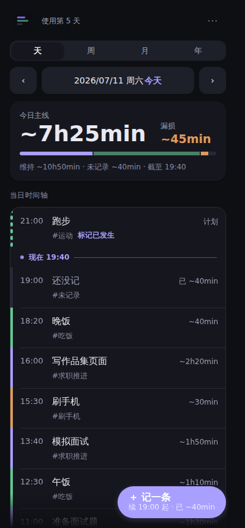
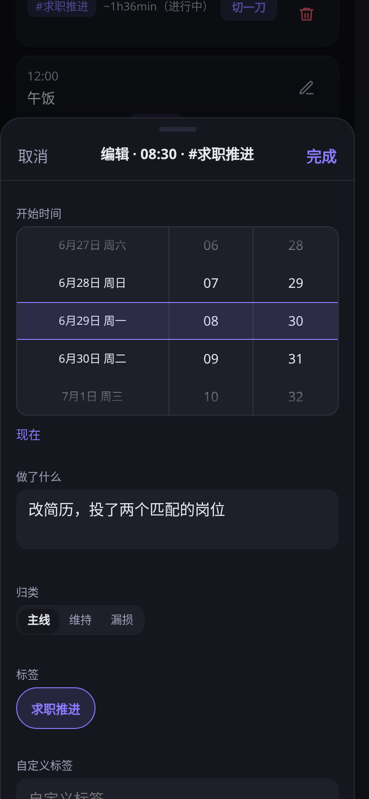

# 时间尺

> Status: active · 已上线，可日常使用；进度与待办见 [STATUS.md](STATUS.md)
>
> Release: v1.4.2
>
> Updated: 2026-09-24
>
> Intended user: 需要记录每天时间去向并进行每日复盘的个人使用者。
>
> Operating boundary: 本地静态 PWA，只记录时间去向，不做云同步、账号管理、KPI 考核或投资/合规判断。
>
> Risks and failure modes: 忘记记录导致“未记录”偏高、长时间间隔被整体计为未记录、周/月/年视图诱发过度复盘、浏览器本地数据或运行缓存被系统清理。

**5 秒记下真实做了什么——本地、离线、可信的一天时间线**

中文名**时间尺**，英文名 **Eigentime**。「5 秒」是降低记录成本的设计目标，尚无实测证明已达标。

应用地址：**https://time.eigentime.org/app/**。旧地址 `wowayou.github.io/time-logger/` 自 v76 起**已转为只读**：完整应用可浏览、可导出，但不再提供任何新增/编辑入口，页面顶部常驻迁移横幅。





## 项目边界

- **已完成的核心闭环**：记录、计划、补录、完整区间编辑、切分、删除与撤销；天/周/月/年统计；完整 JSON 备份、安全合并导入和本地 Markdown 摘要。
- **当前形态**：纯静态、零运行时依赖、无构建的原生 ES modules PWA；数据只在当前设备和 origin 的 `localStorage`，没有账号、后端或云同步。
- **可靠性基础**：写操作使用事务 planner、最新数据复核和结果签名；Service Worker 提供离线缓存与显式更新；Chromium + WebKit 自动化覆盖主要交互、存储、导入和跨标签冲突路径。
- **iOS 冷启动限制**：主屏 PWA 仍有冷启动迟缓的真机记录。现有诊断只能测量页面内阶段，无法覆盖点击图标到系统拉起进程的时间；桌面测试通过不等于真机问题解决。取证与结案见 [故障记录 P33](docs/postmortems.md)。
- **原生载体**：安卓壳已按 D26 在独立仓库开发，内嵌本仓运行时；发布状态见 [STATUS.md](STATUS.md)。它与 PWA 的数据独立，迁移需导出、导入备份。iOS 原生载体仍受 D17 的门槛约束。
- **验证边界**：个人自用和自动化测试不等于市场验证；外部用户研究进度以 [STATUS.md](STATUS.md) 为准。

## 文档入口

| 需要了解 | 唯一入口 |
|---|---|
| 当前进度、待办与阻塞 | [STATUS.md](STATUS.md) |
| 日常使用与四桶含义 | [使用与理念](使用与理念.md) |
| 维护规则、模块边界、版本仪式 | [CLAUDE.md](CLAUDE.md) |
| 改动是否值得做、开发与真机调试 | [CONTRIBUTING.md](CONTRIBUTING.md) |
| 接手须知、历史材料导航 | [docs/HANDOFF.md](docs/HANDOFF.md) |
| 候选方向及其门槛 | [docs/roadmap.md](docs/roadmap.md) |

决策理由见 [docs/decisions.md](docs/decisions.md)，故障根因见 [docs/postmortems.md](docs/postmortems.md)；近期版本记录在 `CLAUDE.md`，早期版本在 [docs/CHANGELOG.md](docs/CHANGELOG.md)。历史材料中的旧阶段安排不构成当前待办或开工授权。

## 和「屏幕使用时间」类工具的区别

自动统计（iPhone 屏幕使用时间等）回答「设备被用了多久」，时间尺回答「你的一天去了哪里」：覆盖不在屏幕上的时间（面试、睡觉、通勤），由你自己按主线/维持/偏航/未记录做相对目标的价值归类（自动埋点分不清同一个 App 里的推进和逃避），并把说不清去向的时间显式呈现为「未记录」而不是让它消失；手动记录动作本身就是复盘干预。完整论述见[《使用与理念》](使用与理念.md)。

应用离线优先：首次联网加载让 Service Worker 缓存运行时文件后，断网也能记录、编辑、统计和备份，数据始终只在本机。

这里的「完整备份」指把当前记录与标签配置完整导出为 JSON。当前导入采用安全合并：会保留备份中没有的本机记录，也不会删除它们，因此它不是精确恢复、版本回退或“用备份整体替换当前状态”。

## 本地运行

应用使用原生 ES modules，本地请通过 HTTP server 打开，不要直接双击 `index.html`。

```bash
cd time-logger
python3 -m http.server 8080
# 浏览器打开 http://localhost:8080
```

真机移动端验证不需要推送或部署。手机和电脑同 Wi-Fi 时，可在本机启动：

```bash
python3 -m http.server 8080 --bind 0.0.0.0
# 手机打开 http://<电脑的局域网 IP>:8080/
```

若手机打不开，先检查服务绑定、防火墙、是否同网及 WSL2 端口隔离。普通局域网 HTTP 只能测交互；离线缓存和安装更新需 HTTPS，详见 [真机调试](CONTRIBUTING.md#本地真机调试)。

## 装到手机主屏（PWA）

iOS Safari：打开页面 → 分享 → 添加到主屏幕。  
Android Chrome：打开页面 → 菜单 → 添加到主屏幕。

应用已包含 SVG 源图标、192/512 PNG、maskable PNG 和 Apple touch icon。Android Chrome 的安装入口仍由浏览器根据 manifest、Service Worker、HTTPS/Pages 访问环境综合判断。

## 发布拓扑与隐私边界

Web 发布使用**两个仓库**（`docs/decisions.md` D12；安卓壳另仓维护）：

1. `wowayou/time-logger`——唯一源码仓库。它自己的 GitHub Pages 就是旧地址 `wowayou.github.io/time-logger/`，v76 起转为只读站。
2. `wowayou/time-logger-site`——公开部署镜像，只存放 `scripts/build_site.py` 生成的产物，绑定自定义域名 `time.eigentime.org`（`/` 是产品主页，`/app/` 是固定 PWA 入口）。镜像里禁止手工维护业务代码。

两者最终都由 GitHub Pages 静态托管，`time.eigentime.org` 通过 DNS 直连。发布由 `v<major>.<minor>.<patch>` tag push 触发 `publish-site` workflow；仅改主页时走手动发布。`build_site.py` 只复制组装静态文件，不编译或打包应用。

自己 fork 部署的话，一个仓库直发根目录就够，不需要镜像那一层。

隐私边界不变：不要把父目录、`toolkit/`、`archive/`、导出的 `timelog-*.json`、真实记录 JSON、真实截图或具体个人线索提交到 GitHub。README 展示图只允许使用 `docs/assets/` 中的固定演示数据 PNG。代码和界面文案可以公开；数据不能公开。每台设备的数据仍只保存在本机 `localStorage['timelog.v1']`，访问站点不会上传、同步或合并记录。

## 多设备使用

- 同一个 Pages URL 只是同一个应用入口，不是云同步。
- 新设备首次打开时本地数据为空。
- 迁移数据靠原设备「存储备份」JSON，再到新设备「导入」。
- iPhone/iPad 的「存储备份」会优先打开系统菜单，可选择「存储到文件」及明确目录；其他浏览器使用原生下载能力，保存位置由浏览器或系统设置决定。
- 不提交导出的备份 JSON，不提交真实记录截图。

## 文件地图

| 文件 | 作用 |
|---|---|
| `index.html` | DOM 壳、PWA/meta 引用、`styles.css` 和 `src/app.js` 模块入口 |
| `styles.css` | 全部样式，包含主题、布局、控件、sheet、更多菜单和响应式规则 |
| `src/app.js` | 启动、状态组合、导航、渲染调度、事件委托和 Service Worker 注册 |
| `src/i18n.js` / `src/locales/` | 中英文文案与格式化，语言偏好由 storage 持久化 |
| `src/entry_model.js` | 记录日期模型、续记/占位/结算点、统一区间编辑/切分/删除事务 planner，以及写后归一化 helper |
| `src/io_actions.js` | 当前视图摘要、复制、下载、导入、分享等本地 IO 动作 |
| `src/sheet_controller.js` | 新建/编辑/config/import sheet、focus trap、picker 重挂载和表单保存 |
| `src/time.js` | 本地日期解析、格式化、周期范围 |
| `src/storage.js` | `localStorage` 数据/config 读写、导入整批预检和安全合并 |
| `src/stats.js` | 纯统计逻辑、按日分段、可选长段待核标记 |
| `src/pickers.js` | 移动滚轮与桌面日期时间选择器 |
| `src/ui.js` | 渲染模板、图标、tooltip helper 和 DOM 更新 |
| `package.json` / `package-lock.json` | 开发期 Playwright 与 TypeScript 类型检查依赖锁定，不参与运行时 |
| `playwright.config.js` / `tests/` | 响应式 UI smoke，启动本地静态 server 验证 |
| `sw.js` | Service Worker，离线缓存 |
| `manifest.webmanifest` | PWA 清单（名称、图标、版本） |
| `icon.svg` | 应用源图标 |
| `icons/` | PWA、maskable 和 Apple touch PNG 图标 |
| `docs/assets/` | README 固定演示数据截图，不放真实记录 |
| `site/` / `scripts/build_site.py` | 产品主页、隐私政策与静态部署组装，不进应用缓存 |
| `native-contract.json` | Web 与安卓壳共用的接口约定，由两仓审计守护 |
| `scripts/project_audit.py` | 开发期红线审计脚本，零运行时依赖 |
| `scripts/confirm_logic_smoke.py` | 确认逻辑、百分比格式和日边界 smoke，调用本机 `node` 执行真实 ES modules |

## 维护审计

```bash
python3 scripts/project_audit.py
python3 scripts/confirm_logic_smoke.py
npm run typecheck
npm run test:ui
git diff --check
```

审计脚本检查 PWA 版本、图标资源、Service Worker 缓存与可靠性护栏、tooltip/icon 红线、README 演示截图白名单和文档隐私红线。确认逻辑 smoke 覆盖区间编辑/切分/删除事务、日边界和随机压测。Playwright 同时跑 Chromium 与 WebKit，覆盖响应式布局、完整区间编辑、删除确认/撤销、左滑轨道、导入冲突、分享降级、跨标签同步和更新提示。

开发期 npm 只允许用于测试：`package.json` 保持 `"private": true`、`"type": "module"`，禁止新增运行时 `dependencies`，禁止提交 `node_modules/`、`test-results/`、`playwright-report/`。应用运行时仍是原生 ES modules + 静态文件，不引入构建流程。

## 数据模型

记录存在 `localStorage['timelog.v1']`，标签配置存在 `localStorage['timelog.config']`。导出的完整备份会同时包含 `entries`、`config` 和可选 `meta`；旧备份没有 `meta` 仍可导入。

```json
{
  "version": 1,
  "meta": {
    "exportedAt": "2026-06-30T04:00:00.000Z",
    "sourceTimezoneOffsetMinutes": -480,
    "sourceTimeZone": "Asia/Shanghai"
  },
  "entries": [
    {
      "id": "abc123",
      "ts": "2026-06-28T09:00",
      "what": "写简历",
      "tags": ["当前主线"],
      "longConfirm": { "startTs": "2026-06-28T09:00", "endTs": "2026-06-28T13:10" }
    }
  ]
}
```

底层是**点存储 + 区间 UX**：每条记录只存一个起点 `ts`，段的结束由右邻记录（或结算点）实时派生，不额外存区间。v48 的完整编辑、切分和删除都先由纯事务 planner 计算 `resultEntries` 与预览：边界不得跨自然日、越过相邻记录或产生零时长；提交前会在最新本机数据上重算，若结果变化则要求再次确认。所有写路径最终仍经归一化，去掉冗余边界并维持诚实的未记录占位。

续记以所看日期为准：空日从 00:00 开始；尾部未记录或今天的进行中段默认续该点；历史日尾部是真实记录时，从其后一分钟补记，尾点为 23:59 则不再提供新增入口。今天无右邻时结算到当前时间，非今天无右邻时结算到 24:00。时长实时派生，不存储。统计以本地自然日 00:00 为硬边界：空日不继承前一天标签；有明确右邻的跨日闭合段最多切入次日，右邻在后天或更晚则止于当日 24:00。周/月/年按每日统计累加。分钟数是权威值，百分比只作展示，不反向参与统计、不强行凑满 100%；`pending` 是可与四桶重叠的待核注记。

标签渲染时派生为 4 桶：主线 `job`、维持 `maintain`、偏航 `leak`、未记录 `unrecorded`（第三桶 v69 起显示为「偏航」，内部键仍是 `leak`，存量备份与配置无需迁移）。自定义标签首次使用时按所选桶记住，已有同名标签保持原归类；孤儿标签和“未知”计为**未记录**。v89 起长段待核默认关闭：明确标签段无论多长都直接按原标签统计。若在「更多 → 高级」显式开启，超过 3h 的非 `longOk` 段会附加“待核”提醒，但仍留在原桶；“确认”只清除提醒，不再改变统计结果。存量 `longConfirm` 保留，不迁移、不删除；该开关是本机偏好，导入备份不会替用户开启。

## 功能清单

- 记录 / 编辑完整开始—结束区间；今日尾段可选「至今」或固定结束，固定后自动留下未记录尾段
- 删除前展示确切结果：仅两侧内容和标签完全一致时接回，否则原区间转未记录；删除后最多 8 秒可撤销，下一次其它交互或跨标签修改会使撤销失效
- 段内有界补录与切分：冻结原段边界，支持内部、贴边和整段改写，不会吞掉其它记录
- 触摸/触控笔左滑揭示 2×72px 编辑/删除轨道；鼠标与键盘继续使用点卡编辑和编辑页删除
- 计划模式：计划条不计入 4 桶统计，时间到可点「标记已发生」转为已发生记录
- 可选长段待核提醒（默认关闭）：开启后提示超过 3h 的非 `longOk` 明确标签段，不阻断原标签统计
- 天 / 周 / 月 / 年视图：天视图可编辑，周/月/年只读汇总并可下钻
- 今天的「正在做」状态条：显示当前活动与已持续时长，点击可编辑
- 「更多」里的时间拨号盘：按桶和标签查看周期对比、趋势，记录不足时明确提示
- 中英文界面；切换语言不翻译或改写已有标签
- 移动端日期滚轮选择器（补录用），支持触控、鼠标滚轮、方向键
- 桌面端自定义日期/时间选择器（popover 日历 + 时分步进），并保留 `YYYY-MM-DD HH:mm` 精确输入文本框
- 文本时间输入接受 `2026/6/28 9:5`、`2026.6.28 9:05`、`2026-06-28T09:05` 等完整日期时间；不接受仅 `9:30` 这类省略日期输入
- 时间尺：主线 / 维持 / 偏航 / 未记录 占比可视化
- 桌面鼠标悬停 tooltip 延迟约 800ms 显示，移开立即隐藏；键盘 `focus-visible` 立即显示；触屏不显示 hover tooltip
- 自动 / 亮色 / 暗色分段主题控件
- 阶段格言：日视图结论卡下方一行小字（未设置显示默认句「记录是手段，推进主线才是目的。」），点行或经「···」更多编辑，清空即隐藏；随完整备份迁移
- 低频动作收纳在「···」更多菜单：摘要、备份四项、标签高级设置、阶段格言、主题、说明
- 标签高级设置：每组可新建标签，也可在记一条时直接写自定义标签自动长出；改名会同步迁移历史记录；主线可设为当前主线；一条记录都没有的标签可以删除（有记录的只能改名，避免孤儿标签），新建与删除都在保存前随时可撤销
- 数据完整备份（复制 JSON / 存储 / 分享；iPhone/iPad 存储优先系统文件面板，分享按文件→文本→下载降级，用户取消不会误下载）
- 导入先整批检查；全部冲突都会展开，可逐条保留本机、使用备份或合并文字，全部处理并复核最新本机数据后才原子写入
- 导入是安全合并，不会删除备份中不存在的本机记录；当前不提供精确恢复或版本回退
- JSON 导入先整批预检：相同记录跳过，同 ID 不同内容或同时刻冲突需逐条处理后才可写入；可按时区 meta 建议整体平移
- 当前视图摘要复制（Markdown，可直接贴给 AI）
- 离线可用；新版 worker 等待时始终提示，只有点击「更新应用」后才刷新，预缓存失败会继续保留旧版本

## 支持作者（自愿）

若时间尺对你有用，可以在 [`eigentime.org/support`](https://eigentime.org/support?from=time-logger) 自愿支持作者。这完全自愿：所有功能始终免费、无广告无内购，支持也不购买任何功能、优先权或产品方向。链接指向 eigentime.org 的中转页而不是收款平台本身（决策见 `docs/decisions.md` D30）。

## 许可证与版权

时间尺由 **wowayou** 开发并版权所有（© 2026 wowayou）。

- **开源许可**：以 [AGPL-3.0-or-later](LICENSE) 发布。你可以自由使用、研究、修改与再分发；**通过网络对外提供服务时也必须向用户开放对应源码**（AGPL §13），衍生作品须以同一许可证开源。
- **商用 / 双许可**：作为唯一著作权人，作者保留在 AGPL 之外另行授权的权利。若需在闭源或无法满足 AGPL 义务的场景下商用，可通过 [项目仓库](https://github.com/wowayou/time-logger) 联系另谈授权。

每个运行时文件顶部都带 `SPDX-License-Identifier` 标识；界面文案与代码可公开，个人数据始终只留在本机、永不上传。
